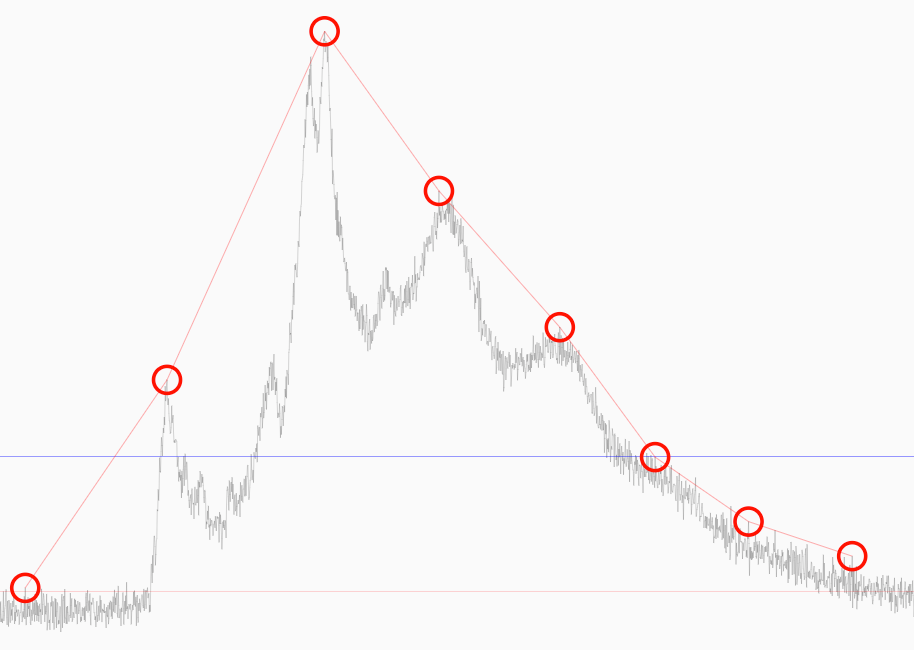

# Detection of peaks in data

Javascript port of an original python function for the detection of peaks in
value arrays. For an understanding of parameters and what this package really
does please checkt this orginal documentation at: 

 - https://nbviewer.jupyter.org/github/demotu/BMC/blob/master/notebooks/DetectPeaks.ipynb

I use it find peaks in my IMS data (more on this another time):



## Install 

  $ npm install "@joe_six/duarte-watanabe-peak-detection"

## Usage

```javascript
const detect_peaks = require("@joe_six/duarte-watanabe-peak-detection")

let x = [0, 1, 0, 2, 0, 3, 0, 2, 0, 1, 0]
// set minimum peak distance = 2
var peaks = detect_peaks(x, {mpd: 2})
```

## Notice

The implementation can be found in github: 

 - https://github.com/flowerpilot/Duarte-Watanabe-Peak-Detection-Javascript-Port

This is a 0.1.something release. NOT Optimized, briefly tested, and full of debug code artifacts. But it seems to be working already, for me at least. ymmv, 

have fun
